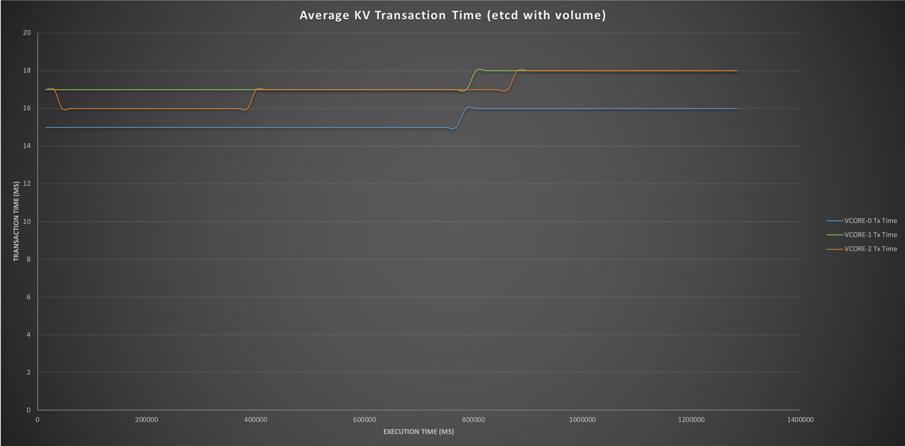

## 1 - Overview

This document provides information on performance tests conducted on the VOLTHA 1.3 platform.

The results of the tests will be used as a capability baseline for future releases.

---

## 2 - Test Environment

All virtual machines are deployed on a single physical server and the installation is done using a modified instance of 
the voltha-k8s-playground (see `5.1 Virtual Environment Installation` for more details).
The following diagram describes the layout used for the test environment.

---


---

### 2.1 - Container images

The following packages were used to perform the different test scenarios.  All VOLTHA images were retrieved from the 
voltha docker hub repository, aside from the voltha/voltha-voltha image which was modified as explained in
`5.3 Disable Alarms and Performance Metrics`.

---

```
    voltha/voltha-ponsim                                             v1.3 
    voltha/voltha-tester                                             v1.3
    voltha/voltha-onos                                               v1.3
    voltha/voltha-ofagent                                            v1.3
    voltha/voltha-envoy                                              v1.3
    voltha/voltha-cli                                                v1.3
    voltha/voltha-netconf                                            v1.3
    voltha/voltha-voltha                                             v1.3 (modified)
    nginx                                                            1.13
    heketi/heketi                                                    dev
    quay.io/coreos/etcd                                              v3.2.18 (voltha etcd)
    gcr.io/google-containers/hyperkube                               v1.9.5
    quay.io/coreos/etcd-operator                                     v0.9.1
    gluster/gluster-centos                                           latest
    quay.io/calico/node                                              v2.6.8
    quay.io/calico/cni                                               v1.11.4
    gcr.io/google_containers/kubernetes-dashboard-amd64              v1.8.3
    quay.io/kubernetes-ingress-controller/nginx-ingress-controller   0.10.2
    busybox                                                          1.28.0-glibc
    zookeeper                                                        3.4.11
    alpine                                                           3.6
    gcr.io/google_containers/k8s-dns-dnsmasq-nanny-amd64             1.14.8
    gcr.io/google_containers/k8s-dns-sidecar-amd64                   1.14.8
    gcr.io/google_containers/k8s-dns-kube-dns-amd64                  1.14.8
    quay.io/calico/ctl                                               v1.6.3
    wurstmeister/kafka                                               1.0.0
    consul                                                           0.9.2
    tpdock/freeradius                                                latest
    quay.io/coreos/etcd                                              v3.2.4 (k8s etcd)
    gcr.io/google_containers/cluster-proportional-autoscaler-amd64   1.1.2
    k8s.gcr.io/fluentd-gcp                                           1.30
    gcr.io/google_containers/pause-amd64                             3.0
```  

---

## 3 - Test Scenarios

This section describes the different scenarios that have been executed.

* The performance test scripts are executed from the host server, i.e. outside of the virtual cluster, to avoid
additional strain on the system.  
* The VOLTHA system is deployed with the minimal set of components required by the individual scenarios
* Logging is kept to a minimum to reduce IO congestion (e.g. errors only)
* Any additional settings will be described in the individual scenarios.
    
---

### 3.1 - Scenario A: Saturation point of a system with ETCD 

This test __creates and enables simulated_olt__ devices against a VOLTHA deployment until it reaches 
the saturation point, i.e. the maximum number of devices that the environment can support until the system stops 
responding or some other failure occurs and prevents any devices from being added.

This test uses `etcd` as the key/value store using only the container disk as storage.

---

#### 3.1.1 - Configuration

* Reduce logging of events in `vcore`.
    * See `5.2 Decrease Logging of Events`.    
* Disable the generation of alarms and performance metrics in `vcore`.  
    * See `5.3 Disable Alarms and PMs`.     
* Adjust the `etcd` cluster configuration
    * See `5.4 Optimize Etcd cluster`.

---

#### 3.1.2 - Deployed containers

```
    NAME                             READY     STATUS    RESTARTS   AGE       IP               NODE
    etcd-7b57x4z7mp                  1/1       Running   0          48m       10.233.70.7      k8s3
    etcd-9gd46fjqvd                  1/1       Running   0          48m       10.233.68.12     k8s2
    etcd-dwrj6s5476                  1/1       Running   0          48m       10.233.70.23     k8s1
    etcd-operator-67cc97bf76-hdwkz   1/1       Running   0          48m       10.233.68.7      k8s2
    fluentd-7c68b                    1/1       Running   0          48m       10.233.70.6      k8s3
    fluentd-7qwww                    1/1       Running   0          48m       10.233.102.197   k8s1
    fluentd-dr95d                    1/1       Running   0          48m       10.233.68.6      k8s2
    fluentdactv-57bb6f4bcd-6dghj     1/1       Running   0          3m        10.233.102.203   k8s1
    fluentdstby-69699b7454-bvx8h     1/1       Running   0          48m       10.233.70.5      k8s3
    kafka-0                          1/1       Running   1          3m        10.233.102.204   k8s1
    kafka-1                          1/1       Running   0          48m       10.233.70.4      k8s3
    kafka-2                          1/1       Running   0          48m       10.233.68.5      k8s2
    vcli-6d5f996f87-bmpx4            1/1       Running   0          48m       10.233.68.11     k8s2
    vcli-6d5f996f87-kpv4b            1/1       Running   0          3m        10.233.70.11     k8s3
    vcore-0                          1/1       Running   0          48m       10.233.68.8      k8s2
    vcore-1                          1/1       Running   0          3m        10.233.102.205   k8s1
    vcore-2                          1/1       Running   0          48m       10.233.70.9      k8s3
    voltha-c797d4c9f-wq7pd           1/1       Running   0          48m       10.233.68.10     k8s2
    zookeeper1-0                     1/1       Running   0          49m       10.233.70.3      k8s3
    zookeeper2-0                     1/1       Running   0          49m       10.233.68.4      k8s2
    zookeeper3-0                     1/1       Running   0          3m        10.233.102.206   k8s1
```

---

#### 3.1.3 - Observations

The creation of devices was constant and it gradually depleted the available memory.  The system reached
saturation after creating `2338` devices and then containers started to degrade.

---


  
---


---


---


---


---


---


---

### 3.2 - Scenario B: Saturation point of a system with ETCD & PV

This test __creates and enables simulated_olt__ devices against a VOLTHA deployment until it reaches 
the saturation point, i.e. the maximum number of devices that the environment can support until the system stops 
responding or some other failure occurs and prevents any devices from being added.

This test uses `etcd` as the key/value store along with a persistent volume for storage which is managed by `glusterfs`.

---

#### 3.2.1 - Configuration

* Reduce logging of events in `vcore`.
    * See `5.2 Decrease Logging of Events`.    
* Disable the generation of alarms and performance metrics in `vcore`.  
    * See `5.3 Disable Alarms and PMs`.     
* Adjust the `etcd` cluster configuration
    * See `5.4 Optimize Etcd cluster`.
* Add persistent volume support to `etcd` cluster configuration
    * See `5.5 Add Persistent Volume to Etcd Cluster`.

---

#### 3.2.2 - Deployed containers

```
    NAME                             READY     STATUS    RESTARTS   AGE       IP               NODE
    etcd-k7blcdbx85                  1/1       Running   0          1h        10.233.70.40     k8s3
    etcd-npln6dnfbg                  1/1       Running   0          1h        10.233.102.221   k8s1
    etcd-operator-67cc97bf76-85frj   1/1       Running   0          1h        10.233.68.39     k8s2
    etcd-vhvpj6v452                  1/1       Running   0          1h        10.233.68.42     k8s2
    fluentd-7c5fn                    1/1       Running   0          1h        10.233.68.38     k8s2
    fluentd-p89dt                    1/1       Running   0          1h        10.233.70.36     k8s3
    fluentd-zgg5l                    1/1       Running   0          1h        10.233.102.218   k8s1
    fluentdactv-57bb6f4bcd-66lrb     1/1       Running   0          1h        10.233.68.37     k8s2
    fluentdstby-69699b7454-frpgm     1/1       Running   0          1h        10.233.70.35     k8s3
    kafka-0                          1/1       Running   0          1h        10.233.102.217   k8s1
    kafka-1                          1/1       Running   0          1h        10.233.70.34     k8s3
    kafka-2                          1/1       Running   0          1h        10.233.68.36     k8s2
    vcli-6d5f996f87-c4p4z            1/1       Running   0          1h        10.233.102.222   k8s1
    vcli-6d5f996f87-qtrcj            1/1       Running   0          1h        10.233.68.43     k8s2
    vcore-0                          1/1       Running   0          1h        10.233.102.219   k8s1
    vcore-1                          1/1       Running   0          1h        10.233.68.41     k8s2
    vcore-2                          1/1       Running   0          1h        10.233.70.39     k8s3
    voltha-c797d4c9f-b9w2m           1/1       Running   0          1h        10.233.70.38     k8s3
    zookeeper1-0                     1/1       Running   0          1h        10.233.70.32     k8s3
    zookeeper2-0                     1/1       Running   0          1h        10.233.70.31     k8s3
    zookeeper3-0                     1/1       Running   0          1h        10.233.70.33     k8s3
    
    / $ ETCDCTL_API=3 etcdctl --write-out=table endpoint status
    +----------------+------------------+---------+---------+-----------+-----------+------------+
    |    ENDPOINT    |        ID        | VERSION | DB SIZE | IS LEADER | RAFT TERM | RAFT INDEX |
    +----------------+------------------+---------+---------+-----------+-----------+------------+
    | 127.0.0.1:2379 | f9ac36a599595044 |  3.2.18 |  2.3 GB |     false |        13 |     298513 |
    +----------------+------------------+---------+---------+-----------+-----------+------------+
```

---

#### 3.2.3 - Observations

The creation of devices was constant and it gradually depleted the available memory.  The system reached
saturation after creating `1820` devices and when containers started to degrade.

---


---


---


---


---


---


---


---

### 3.3 - Scenario C: Saturation point of a system with Consul

This test __creates and enables simulated_olt__ devices against a VOLTHA deployment until it reaches 
the saturation point, i.e. the maximum number of devices that the environment can support until the system stops 
responding or some other failure occurs and prevents any devices from being added.

This test uses `consul` as the key/value store along with a local volume (on vm) for storage.

---

#### 3.3.1 - Configuration

* Reduce logging of events in `vcore`.
    * See `5.2 Decrease Logging of Events`.    
* Disable the generation of alarms and performance metrics in `vcore`.  
    * See `5.3 Disable Alarms and PMs`.     

---

#### 3.3.2 - Deployed containers

```
    NAME                           READY     STATUS    RESTARTS   AGE       IP               NODE
    consul-0                       1/1       Running   0          10m       10.233.68.11     k8s2
    consul-1                       1/1       Running   0          6m        10.233.102.201   k8s1
    consul-2                       1/1       Running   0          6m        10.233.70.12     k8s3
    fluentd-2b46x                  1/1       Running   0          10m       10.233.68.6      k8s2
    fluentd-cn4dt                  1/1       Running   0          10m       10.233.70.5      k8s3
    fluentd-ljgmn                  1/1       Running   0          10m       10.233.102.197   k8s1
    fluentdactv-57bb6f4bcd-tg5g6   1/1       Running   0          10m       10.233.102.196   k8s1
    fluentdstby-69699b7454-4sqcl   1/1       Running   0          10m       10.233.70.6      k8s3
    kafka-0                        1/1       Running   0          10m       10.233.102.195   k8s1
    kafka-1                        1/1       Running   0          10m       10.233.70.4      k8s3
    kafka-2                        1/1       Running   0          10m       10.233.68.5      k8s2
    vcli-6d5f996f87-99clj          1/1       Running   0          10m       10.233.70.10     k8s3
    vcli-6d5f996f87-glw5k          1/1       Running   0          10m       10.233.68.9      k8s2
    vcore-0                        1/1       Running   0          10m       10.233.70.7      k8s3
    vcore-1                        1/1       Running   0          10m       10.233.68.8      k8s2
    vcore-2                        1/1       Running   0          10m       10.233.102.199   k8s1
    voltha-7ccb56884f-zdndj        1/1       Running   5          10m       10.233.70.9      k8s3
    zookeeper1-0                   1/1       Running   0          11m       10.233.70.3      k8s3
    zookeeper2-0                   1/1       Running   0          11m       10.233.68.4      k8s2
    zookeeper3-0                   1/1       Running   0          11m       10.233.102.194   k8s1
```

---

#### 3.3.3 - Observations

The creation of devices was constant at the beginning but gradually had larger gaps between creation. This is likely caused
by the consul db snapshots occurring throughout the execution.  The system started to degrade after creating `1641` devices,
but containers were re-spawned a few times and the system reached saturation after creating `1854` devices.

---


---


---


---


---


---


---


---

### 3.4 - Scenario D: Recovery of VCORE with a 80% loaded state (ETCD & PV)

This test __creates and enables simulated_olt__ devices against a VOLTHA deployment __until it reaches 
a 80% loaded state__, i.e. __80%__ of the saturation point.  Once the system has reached the loaded state, a 
__non-leader VCORE is terminated__ and the system is monitored to identify the duration of the recovery period 
by continuously issuing requests to retrieve the device list.

This test uses `etcd` as the key/value store managed by `etcd-operator` along with a persistent volume for 
storage managed by `glusterfs`.

---

#### 3.4.1 - Configuration

* Reduce logging of events in `vcore`.
    * See `5.2 Decrease Logging of Events`.    
* Disable the generation of alarms and performance metrics in `vcore`.  
    * See `5.3 Disable Alarms and PMs`.     
* Adjust the `etcd` cluster configuration
    * See `5.4 Optimize Etcd cluster`.
* Add persistent volume support to `etcd` cluster configuration
    * See `5.5 Add Persistent Volume to Etcd Cluster`.

---

#### 3.4.2 - Deployed containers

```
    NAME                             READY     STATUS    RESTARTS   AGE       IP               NODE
    etcd-k7blcdbx85                  1/1       Running   0          1h        10.233.70.40     k8s3
    etcd-npln6dnfbg                  1/1       Running   0          1h        10.233.102.221   k8s1
    etcd-operator-67cc97bf76-85frj   1/1       Running   0          1h        10.233.68.39     k8s2
    etcd-vhvpj6v452                  1/1       Running   0          1h        10.233.68.42     k8s2
    fluentd-7c5fn                    1/1       Running   0          1h        10.233.68.38     k8s2
    fluentd-p89dt                    1/1       Running   0          1h        10.233.70.36     k8s3
    fluentd-zgg5l                    1/1       Running   0          1h        10.233.102.218   k8s1
    fluentdactv-57bb6f4bcd-66lrb     1/1       Running   0          1h        10.233.68.37     k8s2
    fluentdstby-69699b7454-frpgm     1/1       Running   0          1h        10.233.70.35     k8s3
    kafka-0                          1/1       Running   0          1h        10.233.102.217   k8s1
    kafka-1                          1/1       Running   0          1h        10.233.70.34     k8s3
    kafka-2                          1/1       Running   0          1h        10.233.68.36     k8s2
    vcli-6d5f996f87-c4p4z            1/1       Running   0          1h        10.233.102.222   k8s1
    vcli-6d5f996f87-qtrcj            1/1       Running   0          1h        10.233.68.43     k8s2
    vcore-0                          1/1       Running   0          1h        10.233.102.219   k8s1
    vcore-1                          1/1       Running   0          1h        10.233.68.41     k8s2
    vcore-2                          1/1       Running   0          1h        10.233.70.39     k8s3
    voltha-c797d4c9f-b9w2m           1/1       Running   0          1h        10.233.70.38     k8s3
    zookeeper1-0                     1/1       Running   0          1h        10.233.70.32     k8s3
    zookeeper2-0                     1/1       Running   0          1h        10.233.70.31     k8s3
    zookeeper3-0                     1/1       Running   0          1h        10.233.70.33     k8s3
```

---

#### 3.4.3 - Observations

The system was stable after creating the devices.  As soon as a VCORE was terminated, the communication
with the etcd cluster started to degrade.  The `etcd` instances failed one by one and the KV cluster
never recovered.  It seems that the etcd cluster unable to manage the lack of resources and the instances terminate
themselves and eventually quorum is lost.

This reported issue [coreos/etcd-operator #1323](https://github.com/coreos/etcd-operator/issues/1323) may explain part 
of the behaviour that we are experiencing.

---

### 3.5 - Scenario E: Recovery of VCORE with a 60% loaded state (ETCD & PV)

This test __creates and enables simulated_olt__ devices against a VOLTHA deployment __until it reaches 
a 60% loaded state__, i.e. __60%__ of the saturation point.  Once the system has reached the loaded state, a __non-leader
VCORE is terminated__ and the system is monitored to identify the duration of the recovery period by continuously 
issuing requests to retrieve the device list.

This test uses `etcd` as the key/value store managed by `etcd-operator` along with a persistent volume for 
storage managed by `glusterfs`.

---

#### 3.5.1 - Configuration

* Reduce logging of events in `vcore`.
    * See `5.2 Decrease Logging of Events`.    
* Disable the generation of alarms and performance metrics in `vcore`.  
    * See `5.3 Disable Alarms and PMs`.     
* Adjust the `etcd` cluster configuration
    * See `5.4 Optimize Etcd cluster`.
* Add persistent volume support to `etcd` cluster configuration
    * See `5.5 Add Persistent Volume to Etcd Cluster`.

---

#### 3.5.2 - Deployed containers

```
    NAME                             READY     STATUS    RESTARTS   AGE       IP               NODE
    etcd-k7blcdbx85                  1/1       Running   0          1h        10.233.70.40     k8s3
    etcd-npln6dnfbg                  1/1       Running   0          1h        10.233.102.221   k8s1
    etcd-operator-67cc97bf76-85frj   1/1       Running   0          1h        10.233.68.39     k8s2
    etcd-vhvpj6v452                  1/1       Running   0          1h        10.233.68.42     k8s2
    fluentd-7c5fn                    1/1       Running   0          1h        10.233.68.38     k8s2
    fluentd-p89dt                    1/1       Running   0          1h        10.233.70.36     k8s3
    fluentd-zgg5l                    1/1       Running   0          1h        10.233.102.218   k8s1
    fluentdactv-57bb6f4bcd-66lrb     1/1       Running   0          1h        10.233.68.37     k8s2
    fluentdstby-69699b7454-frpgm     1/1       Running   0          1h        10.233.70.35     k8s3
    kafka-0                          1/1       Running   0          1h        10.233.102.217   k8s1
    kafka-1                          1/1       Running   0          1h        10.233.70.34     k8s3
    kafka-2                          1/1       Running   0          1h        10.233.68.36     k8s2
    vcli-6d5f996f87-c4p4z            1/1       Running   0          1h        10.233.102.222   k8s1
    vcli-6d5f996f87-qtrcj            1/1       Running   0          1h        10.233.68.43     k8s2
    vcore-0                          1/1       Running   0          1h        10.233.102.219   k8s1
    vcore-1                          1/1       Running   0          1h        10.233.68.41     k8s2
    vcore-2                          1/1       Running   0          1h        10.233.70.39     k8s3
    voltha-c797d4c9f-b9w2m           1/1       Running   0          1h        10.233.70.38     k8s3
    zookeeper1-0                     1/1       Running   0          1h        10.233.70.32     k8s3
    zookeeper2-0                     1/1       Running   0          1h        10.233.70.31     k8s3
    zookeeper3-0                     1/1       Running   0          1h        10.233.70.33     k8s3
```

---

#### 3.5.3 - Observations

The system was stable after creating the devices.  A VCORE instance was terminated, it re-spawned and started 
recovering its data from the etcd cluster.  While the recovery was in progress, one of the etcd instance showed 
a ready status of `0/1` and eventually came back to `1/1` once VCORE reconciled all the data.  During the recovery
period, requests to the VOLTHA API to retrieve the device list remained unresponsive, but eventually resumed.

---


---

### 3.6 - Scenario F: Recovery of VCORE with a 80% loaded state (Consul)

This test __creates and enables simulated_olt__ devices against a VOLTHA deployment __until it reaches 
a loaded state__, i.e. __80%__ of the saturation point.  Once the system has reached the loaded state, a __non-leader
VCORE is terminated__ and the system is monitored to identify the duration of the recovery period by continuously 
issuing requests to retrieve the device list.

This test uses `consul` as the key/value store along with a local volume (on vm) for storage.

---

#### 3.6.1 - Configuration

* Reduce logging of events in `vcore`.
    * See `5.2 Decrease Logging of Events`.    
* Disable the generation of alarms and performance metrics in `vcore`.  
    * See `5.3 Disable Alarms and PMs`.     

---

#### 3.6.2 - Deployed containers

```
    NAME                           READY     STATUS    RESTARTS   AGE       IP               NODE
    consul-0                       1/1       Running   0          10m       10.233.68.11     k8s2
    consul-1                       1/1       Running   0          6m        10.233.102.201   k8s1
    consul-2                       1/1       Running   0          6m        10.233.70.12     k8s3
    fluentd-2b46x                  1/1       Running   0          10m       10.233.68.6      k8s2
    fluentd-cn4dt                  1/1       Running   0          10m       10.233.70.5      k8s3
    fluentd-ljgmn                  1/1       Running   0          10m       10.233.102.197   k8s1
    fluentdactv-57bb6f4bcd-tg5g6   1/1       Running   0          10m       10.233.102.196   k8s1
    fluentdstby-69699b7454-4sqcl   1/1       Running   0          10m       10.233.70.6      k8s3
    kafka-0                        1/1       Running   0          10m       10.233.102.195   k8s1
    kafka-1                        1/1       Running   0          10m       10.233.70.4      k8s3
    kafka-2                        1/1       Running   0          10m       10.233.68.5      k8s2
    vcli-6d5f996f87-99clj          1/1       Running   0          10m       10.233.70.10     k8s3
    vcli-6d5f996f87-glw5k          1/1       Running   0          10m       10.233.68.9      k8s2
    vcore-0                        1/1       Running   0          10m       10.233.70.7      k8s3
    vcore-1                        1/1       Running   0          10m       10.233.68.8      k8s2
    vcore-2                        1/1       Running   0          10m       10.233.102.199   k8s1
    voltha-7ccb56884f-zdndj        1/1       Running   5          10m       10.233.70.9      k8s3
    zookeeper1-0                   1/1       Running   0          11m       10.233.70.3      k8s3
    zookeeper2-0                   1/1       Running   0          11m       10.233.68.4      k8s2
    zookeeper3-0                   1/1       Running   0          11m       10.233.102.194   k8s1
```

---

#### 3.6.3 - Observations

The system is stable after creating the devices.  When a VCORE is terminated, the consul cluster remains stable and
calls to the VOLTHA API to retrieve the list of devices are returning 2/3 of the created devices, which is expected
with the current design.  The system fully recovers after approximately 2 minutes and all the devices are accounted for.

---


  
---

### 3.7 - Scenario G: Average KV Transaction Period (ETCD & PV)

This test creates and enables simulated_olt devices against a VOLTHA deployment until it reaches 
a 80% loaded state, i.e. 80% of the saturation point, and calculates the average time required to perform
a `put` operation to the key/value store.  The average time is collected and calculated for every block of 1000
transactions.

This test uses `etcd` as the key/value store managed by `etcd-operator` along with a persistent volume for 
storage managed by `glusterfs`.

---

#### 3.7.1 - Configuration

* Reduce logging of events in `vcore`.
    * See `5.2  Decrease Logging of Events`.    
* Disable the generation of alarms and performance metrics in `vcore`.  
    * See `5.3 Disable Alarms and PMs`.     
* Adjust the `etcd` cluster configuration
    * See `5.4 Optimize Etcd cluster`.
* Add persistent volume support to `etcd` cluster configuration
    * See `5.5 Add Persistent Volume to Etcd Cluster`.
* Add KV transaction period information.  
    * See `5.6 Add Logs for Average KV Transaction Time`.     

---

#### 3.7.2 - Observations

The transaction time is quite stable.  It increases slightly and equally for each VCORE instances.

---



---

### 3.8 - Scenario H: Average KV Transaction Period (Consul)

This test creates and enables simulated_olt devices against a VOLTHA deployment until it reaches 
a 80% loaded state, i.e. 80% of the saturation point, and calculates the average time required to perform
a `put` operation to the key/value store.  The average time is collected and calculated for every block of 1000
transactions.

This test uses `consul` as the key/value store along with a local volume (on vm) for storage.

---

#### 3.8.1 - Configuration

* Reduce logging of events in `vcore`.
    * See `5.2 Decrease Logging of Events`.    
* Disable the generation of alarms and performance metrics in `vcore`.  
    * See `5.3 Disable Alarms and PMs`.     
* Add KV transaction period information.  
    * See `5.6 Add Logs for Average KV Transaction Time`.     
   
---

#### 3.8.2 - Observations

The transaction time is quite stable.  It increases slightly and equally for each VCORE instances.

---


---

## 4 - General Observations

* An ETCD cluster presents reliability issues when retrieving large amounts of data from a system in a loaded state 
    * Such as when a VCORE is re-spawned.
    * ETCD instances seem to be unable to sustain the load and are eventually terminated.
    * ETCD operator is unable to recover lost instances and eventually declares the cluster as being dead.
    * The following issue was raised against the coreos/etcd-operator project
        * https://github.com/coreos/etcd-operator/issues/1968

* A Consul cluster is able to sustain the stress of a system in a loaded state.
    * More reliable than the ETCD cluster

* A Kubernetes cluster is unstable when running more than one master.
    * We need to investigate the stability when running master nodes independently from worker nodes.
    
---

## 5 - Installation Details

---

### 5.1 - irtual Environment Installation

The virtual environment was deployed using the [Voltha Kubernetes Playgrounds](https://github.com/ciena/voltha-k8s-playground).

The `voltha-k8s-playground` was chosen for this task, to speed up the process of setting up for the different test
scenarios.  The playground files were slightly modified to work on a server running the libvirt library.

---

```
   diff --git a/Vagrantfile b/Vagrantfile
   index 84342be..a93abaf 100644
   --- a/Vagrantfile
   +++ b/Vagrantfile
   @@ -10,6 +10,7 @@ Vagrant.configure(2) do |config|
          s.ssh.forward_agent = true
          s.vm.box = "bento/ubuntu-16.04"
          s.vm.hostname = "k8s#{i}"
   +      s.vm.synced_folder ".", "/vagrant", type: "nfs"

          s.vm.network "private_network", ip: "172.42.42.10#{i}", netmask: "255.255.255.0",
            auto_config: true
   @@ -20,6 +21,11 @@ Vagrant.configure(2) do |config|
            v.cpus = 2
            v.gui = false
          end
   +      s.vm.provider "libvirt" do |v|
   +        v.memory = 6144
   +        v.cpus = 2
   +        v.storage :file, :size => '50G', :type => 'raw', :bus => 'virtio'
   +      end

          s.vm.provision "file", source: "#{Dir.home}/.ssh/id_rsa", destination: "/home/vagrant/.ssh/id_rsa"
          s.vm.provision :shell, :inline =>"
```

---

The playground uses a pre-packaged vagrant box which is not libvirt compatible.  In order to use the bento/ubuntu-16.04 
vagrant box, the following commands need to be issued.

---

```
    # Install some plugins
    
    vagrant plugin install vagrant-libvirt
    vagrant plugin install vagrant-mutate
    
    # Install the vagrant box
    
    vagrant box add bento/ubuntu-16.04
    vagrant mutate bento/ubuntu-16.04 libvirt
```

---

Once you have applied the modifications, you can bring up the cluster as per the instructions of the playground.

---

### 5.2 - Decrease Logging of Events

Many of the VOLTHA containers were implemented with an option to control the logging of events.

If you see the `-v` (e.g. verbose) option used in the VOLTHA manifest, it can be replaced with `-q` (quiet) to inform
the container to only log error events.  Below is an example to reduce logging in `vcore`.

---

```
    diff --git a/k8s/vcore_for_etcd.yml b/k8s/vcore_for_etcd.yml
    index f3703ff..e54aa34 100644
    --- a/k8s/vcore_for_etcd.yml
    +++ b/k8s/vcore_for_etcd.yml    
    @@ -44,7 +51,7 @@ spec:
                      fieldPath: metadata.namespace
              args:
                - "voltha/voltha/main.py"
    -           - "-v"
    +           - "-q"
                - "--etcd=etcd.$(NAMESPACE).svc.cluster.local:2379"
                - "--kafka=kafka.$(NAMESPACE).svc.cluster.local"
                - "--rest-port=8880"
```

---

### 5.3 - Disable Alarms and Performance Metrics

In order to reduce IO congestion, the simulated_olt adapter can be modified to exclude the generation of alarms and 
performance metrics.  This can be done by applying the following changes and re-building the voltha/voltha-voltha image.

---

```
    diff --git a/voltha/adapters/simulated_olt/simulated_olt.py b/voltha/adapters/simulated_olt/simulated_olt.py
    index 0e6a3ac..bce9c8a 100644
    --- a/voltha/adapters/simulated_olt/simulated_olt.py
    +++ b/voltha/adapters/simulated_olt/simulated_olt.py
    @@ -567,9 +567,9 @@ class SimulatedOltAdapter(object):
            self.adapter_agent.update_device(device)
    
            reactor.callLater(0.1, self._simulate_detection_of_onus, device.id)
    -       self.start_kpi_collection(device.id)
    +       #self.start_kpi_collection(device.id)
    
    -       self.start_alarm_simulation(device.id)
    +       #self.start_alarm_simulation(device.id)    
```

---

### 5.4 - Optimize Etcd Cluster

The default configuration of an `etcd` container instance is not optimized to achieve the full potential of the system.
The following items need to be applied to ensure a proper deployment and avoid premature failures of the etcd cluster.

* Internal quota set to 6GB instead of the default 2GB.
* Retain an unlimited set of WAL files
* Perform compaction every 10 minutes

---

```
    diff --git a/k8s/operator/etcd/etcd_cluster.yml b/k8s/operator/etcd/etcd_cluster.yml
    index 0945a78..cdaa0aa 100644
    --- a/k8s/operator/etcd/etcd_cluster.yml
    +++ b/k8s/operator/etcd/etcd_cluster.yml
    @@ -9,3 +9,10 @@ spec:
       pod:
         annotations:
           cni: "calico"
    +    etcdEnv:
    +      - name: ETCD_QUOTA_BACKEND_BYTES
    +        value: "6442450944"
    +      - name: ETCD_MAX_WALS
    +        value: "0"
    +      - name: ETCD_AUTO_COMPACTION_RETENTION
    +        value: "10m"
```

---

### 5.5 - Add Persistent Volume to Etcd Cluster

Adding persistent volume support to an etcd cluster requires some configurations of your virtual cluster.

The following steps will guide you through the installation of glusterfs and the modification of the etcd manifest files
to add a persistent volume.

The virtual cluster should already have allocated storage as per the instructions under 
`5.1Virtual Environment Installation`.  You can verify if your system was properly configured by issuing 
the following command.

---

```
    vagrant@k8s1:~$ sudo fdisk -l /dev/vda
    Disk /dev/vda: 50 GiB, 53687091200 bytes, 104857600 sectors
    Units: sectors of 1 * 512 = 512 bytes
    Sector size (logical/physical): 512 bytes / 512 bytes
    I/O size (minimum/optimal): 512 bytes / 512 bytes
```

---


* You first need to wipe disks (just to be sure).

```
    cd /vagrant && ansible kube-node -a "wipefs -af /dev/vda" -b --become-user=root -i kubespray/inventory/voltha/hosts.ini
```

---

* Load the `dm_thin_pool` linux module

```
    cd /vagrant && ansible kube-node -a "modprobe dm_thin_pool" -b --become-user=root -i kubespray/inventory/voltha/hosts.ini
```

---

NOTE: The module availability will not survive a reboot.  You can make the change persistent by adding `dm_thin_pool` to /etc/modules

---

* Install the `glusterfs` client on each virtual machine
```
    cd /vagrant
    
    ansible kube-node -a "add-apt-repository ppa:gluster/glusterfs-3.12" \
        -b --become-user=root -i kubespray/inventory/voltha/hosts.ini
        
    ansible kube-node -a "apt-get update" \
        -b --become-user=root -i kubespray/inventory/voltha/hosts.ini
        
    ansible kube-node -a "apt-get install -y glusterfs-client" \
        -b --become-user=root -i kubespray/inventory/voltha/hosts.ini
```

---

* Clone the `gluster/gluster-kubernetes` repository

```
    cd /vagrant && git clone https://github.com/gluster/gluster-kubernetes.git
```

---

* Create a topology file under /vagrant/gluster-kubernetes/deploy/topology.json

```
    {
      "clusters": [
        {
          "nodes": [
            {
              "node": {
                "hostnames": {
                  "manage": [
                    "k8s1"
                  ],
                  "storage": [
                    "172.42.42.101"
                  ]
                },
                "zone": 1
              },
              "devices": [
                "/dev/vda"
              ]
            },
            {
              "node": {
                "hostnames": {
                  "manage": [
                    "k8s2"
                  ],
                  "storage": [
                    "172.42.42.102"
                  ]
                },
                "zone": 1
              },
              "devices": [
                "/dev/vda"
              ]
            },
            {
              "node": {
                "hostnames": {
                  "manage": [
                    "k8s3"
                  ],
                  "storage": [
                    "172.42.42.103"
                  ]
                },
                "zone": 1
              },
              "devices": [
                "/dev/vda"
              ]
            }
          ]
        }
      ]
    }
```

---

* Deploy the `glusterfs` containers

```
cd /vagrant/gluster-kubernetes/deploy && ./gk-deploy -gyv --object-capacity 150Gi
```

---

* Create storage class based on the output returned by the deploy command

Adjust the `resturl` parameter as per the information returned after deployment.

```
    cat <<EOF >> /vagrant/k8s/glusterfs-storage.yml
    apiVersion: storage.k8s.io/v1beta1
    kind: StorageClass
    metadata:
      name: glusterfs-storage
      namespace: voltha
    provisioner: kubernetes.io/glusterfs
    parameters:
      resturl: "http://10.233.102.198:8080"
      restuser: "admin"
      restuserkey: "My Secret"
      volumetype: "replicate:2"
    EOF
```

---

* Apply the storage class

```
    kubectl apply -f /vagrant/k8s/glusterfs-storage.yml
```

---

* Modify the `etcd` cluster manifest as follows

```
    apiVersion: "etcd.database.coreos.com/v1beta2"
    kind: "EtcdCluster"
    metadata:
      name: etcd
      namespace: voltha
    spec:
      size: 3
      version: "3.2.18"
      pod:
        annotations:
          cni: "calico"
        etcdEnv:
          - name: ETCD_QUOTA_BACKEND_BYTES
            value: "6442450944"
          - name: ETCD_MAX_WALS
            value: "0"
          - name: ETCD_AUTO_COMPACTION_RETENTION
            value: "10m"
        persistentVolumeClaimSpec:
          accessModes: ["ReadWriteOnce"]
          resources:
            requests:
              storage: 10Gi
          storageClassName: glusterfs-storage
```

---

* Start the cluster and verify persistent volume allocation

```
    kubectl apply -f /vagrant/k8s/operator/etcd_cluster.yml
    
    kubectl -n voltha get pvc
```

---

### 5.6 - Add Logs for Average KV Transaction Time

In order to collect details on the average time required to perform a `put` operation to a key/value store,
the following changes need to be applied to the `voltha` core implementation.  You will need to rebuild the 
`voltha/voltha-voltha` component.

---

```
    diff --git a/voltha/core/config/config_backend.py b/voltha/core/config/config_backend.py
    index 71eeddb7..2659aa1b 100644
    --- a/voltha/core/config/config_backend.py
    +++ b/voltha/core/config/config_backend.py
    @@ -19,6 +19,7 @@ from twisted.internet.defer import inlineCallbacks, returnValue
    
     import etcd3
     import structlog
    +import time
    
     log = structlog.get_logger()
    
    @@ -44,6 +45,9 @@ class ConsulStore(object):
             self._path_prefix = path_prefix
             self._cache = {}
             self.retries = 0
    +        self.total_writes = 0
    +        self.total_time = 0
    +        self.average = 0
    
         def make_path(self, key):
             return '{}/{}'.format(self._path_prefix, key)
    @@ -73,7 +77,17 @@ class ConsulStore(object):
             try:
                 assert isinstance(value, basestring)
                 self._cache[key] = value
    +            start = int(round(time.time() * 1000))
    +            self.total_writes = self.total_writes + 1
                 self._kv_put(self.make_path(key), value)
    +            finish = int(round(time.time() * 1000))
    +            self.total_time = self.total_time + finish - start
    +            self.average = self.total_time/self.total_writes
    +            if self.total_writes % 1000 == 0:
    +                log.error("Time-difference",
    +                          avg=self.average,
    +                          total_writes=self.total_writes,
    +                          total_time=self.total_time)
             except Exception, e:
                 log.exception('cannot-set-item', e=e)
    
    @@ -163,6 +177,9 @@ class EtcdStore(object):
             self._path_prefix = path_prefix
             self._cache = {}
             self.retries = 0
    +        self.total_writes = 0
    +        self.total_time = 0
    +        self.average = 0
    
         def make_path(self, key):
             return '{}/{}'.format(self._path_prefix, key)
    @@ -191,7 +208,17 @@ class EtcdStore(object):
             try:
                 assert isinstance(value, basestring)
                 self._cache[key] = value
    +            start = int(round(time.time() * 1000))
    +            self.total_writes = self.total_writes + 1
                 self._kv_put(self.make_path(key), value)
    +            finish = int(round(time.time() * 1000))
    +            self.total_time = self.total_time + finish - start
    +            self.average = self.total_time/self.total_writes
    +            if self.total_writes % 1000 == 0:
    +                log.error("Time-difference",
    +                         avg=self.average,
    +                         total_writes=self.total_writes,
    +                         total_time=self.total_time)
             except Exception, e:
                 log.exception('cannot-set-item', e=e)
```
